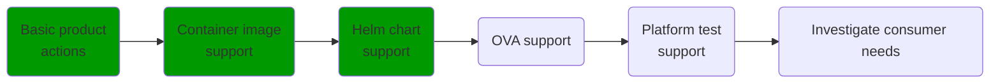

# Marketplace CLI

The Marketplace CLI is a tool that can be used to interact with the [VMware Marketplace](http://marketplace.cloud.vmware.com/).
The primary focus for the CLI is to assist publishers with automation.


## Examples

### CI/CI examples

Adding a new version using [Concourse](https://concourse-ci.org/):
```yaml
resources:
- name: mkpcli
  type: docker-image
  source:
    repository: harbor-repo.vmware.com/tanzu_isv_engineering/mkpcli
- name: version
  type: semver
  source: ...

jobs:
- name: Add version
  plan:
  - get: mkpcli
  - get: version
    params: { bump: patch }
  - task: add-version-to-marketplace
    image: mkpcli
    config:
      inputs:
        - name: version
      platform: linux
      params:
        CSP_API_TOKEN: ((marketplace_api_token))
        SLUG: test-container-product2
      run:
        path: bash
        args:
        - -exc
        - |
          mkpcli product-version create \
            --product my-marketplace-product1 \
            --product-version $(cat version/version)
```

## Roadmap



### Feature descriptions
* Basic product actions - Basic CLI and getting/putting products  
* Container image support - Listing and adding container images to products
* Helm chart support - Listing and adding Helm charts to products
* OVA support - Listing and adding OVAs to products
* Platform test support - List platform test results, initiate platform tests
* Investigate consumer needs - See what worthwhile features

## Developing

### Set up vault (VMware internal)

Get, configure, and log in to vault:

```bash
$ brew install vault
...
$ export VAULT_ADDR=https://runway-vault.svc.eng.vmware.com
$ vault login -method=ldap username=<username>
Password (will be hidden):
Success! You are now authenticated.
...
```

### Enable direnv

Direnv allows for settings to be loaded when entering the directory. Here, it simplifies setting up the development environment so you don't forget.

```bash
brew install direnv
direnv allow
```
### Set GOPATH
Make sure GOPATH is set. e.g. export `PATH=$PATH:$(go env GOPATH)/bin`.
