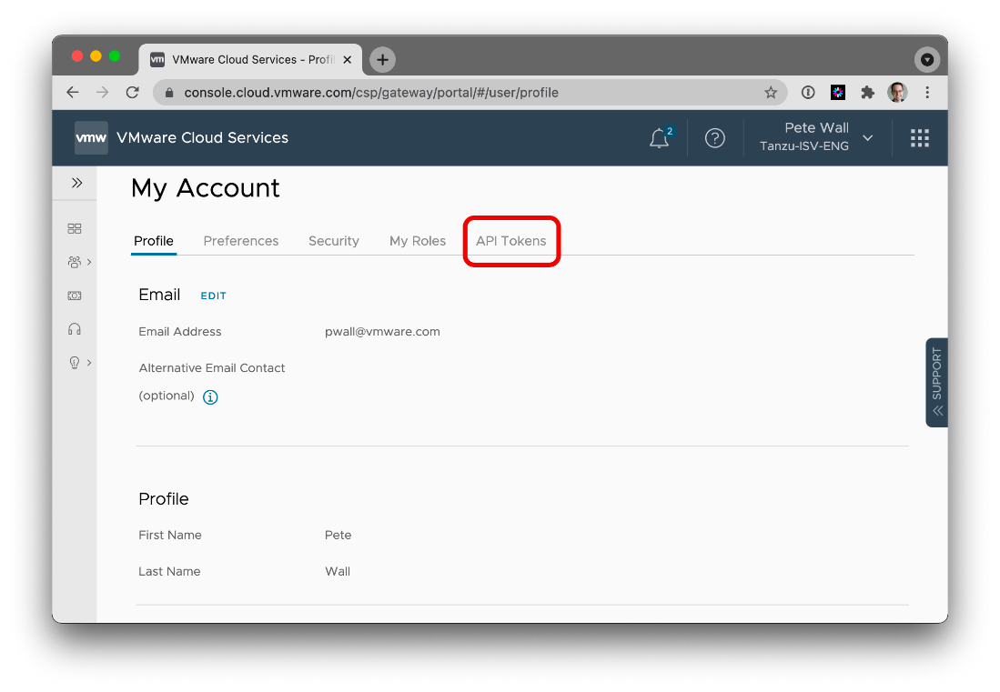

# Authentication

The Marketplace CLI authenticates using a VMware Cloud Services API Token.

## Generating a token


To generate a new API Token:
1. Go to the [API Tokens](https://console.cloud.vmware.com/csp/gateway/portal/#/user/tokens) page on [My Account](https://console.cloud.vmware.com/csp/gateway/portal/#/user/profile)
2. Click "Generate Token"
3. Set the token's name
4. Set the token's expiration
5. Add the "VMware Marketplace" service role

    If your org has access to the Staging Marketplace, add the "Cloud Stage Marketplace" service role

7. No organization role is required
8. Click Generate
9. Record the token somewhere (preferably a secure secret store)

## Using the token

You have two options for passing the API Token to the Marketplace CLI:

### CLI argument

```bash
$ mkpcli products list --csp-api-token <CSP API Token>
```

### Environment variable

```bash
$ export CSP_API_TOKEN=<CSP API Token>
$ mkpcli products list
```
